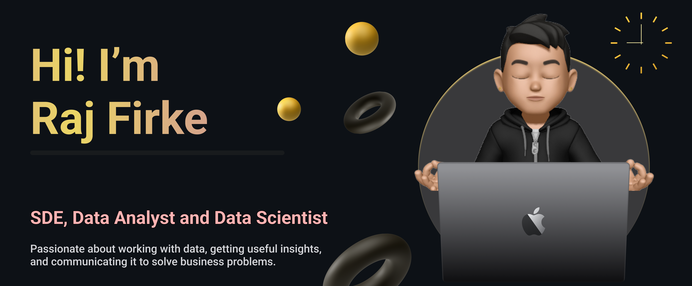

  

## Hi 👀 , I'm Raj Firke,
Hey there! 🚀 Currently on a thrilling journey as a Software Engineer - L1 at Red Hat 🧑‍💻.

Let me jazz up my AI-ML enthusiasm for you:
  - 🤖 Passionate about diving into the captivating realm of AI, where I get to weave together my love for math, science, and programming to tackle intriguing problems.
  - 🌐 Future-tech fanatic! Keeping an eye on the horizon for emerging technologies like agentic workflows and automations using AI. Exciting times ahead! 🚀
  - 💡 Check out my cool projects where I'm putting theory into action. If you have any brilliant ideas or want to contribute, I'm all ears! 🤝

🔗 Let's connect on LinkedIn! Whether you're into tech discussions, or collaboration, or just want to share some cool cat memes, I'm up for it. Can't wait to build connections in the digital universe! 🌐💼

Feel free to reach out and let's embark on this tech adventure together! 🚀👩‍💻

 

## 📞 Connect with me:

 

## 👨‍💻 Technologies:

### Language :

### Tools, Frameworks & Libraries :

         

### OS & Databases :

### Coding Profiles :

 

### Others:
 
 
 
 
 
 

## 📈Stats:

 
  

 
  
<!--    -->
    

## ✍️ Random Dev Quote:

  

